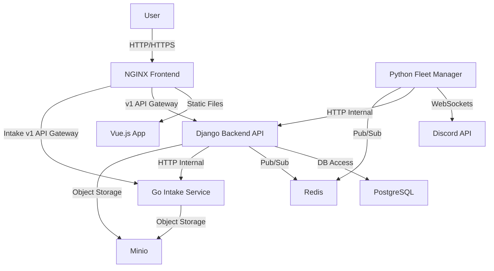

# WatchTower Project Documentation

## 🚀 Welcome to WatchTower!

WatchTower is a multi-tenant, AI-powered operational intelligence platform designed to centralize and automate the processing of security and operational data. It integrates with various chat platforms (like Discord) to provide real-time AI assistance, acting as an intelligent co-pilot for incident response, penetration testing, and CTF (Capture The Flag) workflows.

This project is built as a collection of interconnected microservices, leveraging Python (Django, asyncio), Go, Vue.js, PostgreSQL, Redis, and Minio to create a robust, scalable, and extensible platform.

## ✨ Key Features

*   **Multi-Tenant Architecture:** Supports multiple organizations, each with isolated data and configurations.
*   **Stateless Bot Fleet:** Dynamically manages Discord (and potentially Slack/Mattermost) bots, allowing organizations to "Bring Your Own Bot" (BYOB).
*   **AI-Powered Assistance:** Integrates with LLM providers (e.g., Google Gemini) to process natural language prompts and provide intelligent responses.
*   **Operational Memory:** Centralized storage for `Occurrences` (incidents, pentests), `Evidence` (parsed attachments, chat logs), `Conversations`, and `Messages`.
*   **ETL Pipeline for Attachments:** A dedicated Go microservice (`intake_service`) processes various file types (PCAP, binaries, PDFs, Office docs) from chat attachments, extracts relevant text, and stores it as evidence.
*   **Secure Intake Validation:** Ensures incoming data is well-formed and safe before processing.
*   **Web UI:** A modern Vue.js frontend with Vuetify 3 for managing organizations, LLM provider credentials, bot integrations, and system templates.
*   **Robust Configuration:** Environment-aware settings for seamless local development and containerized deployment.

## 🏗️ High-Level Architecture

WatchTower is composed of several microservices orchestrated by Docker Compose:

1.  **`frontend` (Vue.js + NGINX):** The user interface, served by NGINX, which also acts as an API Gateway.
2.  **`backend` (Django + DRF):** The core API, business logic, and data persistence layer.
3.  **`fleet_manager` (Python asyncio):** A stateless microservice that manages the lifecycle of Discord bot instances. It listens to Redis for commands and forwards messages to the `backend` API.
4.  **`intake_service` (Go):** An ETL pipeline for processing file attachments, extracting text, and storing raw files in Minio.
5.  **`db` (PostgreSQL):** The primary relational database for all application data.
6.  **`redis`:** A high-performance in-memory data store used for Pub/Sub messaging (bot orchestration) and caching.
7.  **`minio`:** An S3-compatible object storage server for storing raw file attachments (evidence).



## 🚀 Getting Started

### Prerequisites

*   Docker & Docker Compose
*   Go (for `intake_service` development)
*   Python 3.11+ (for `backend` & `fleet_manager` development)
*   Node.js & npm/yarn (for `frontend` development)

### 🐳 Running with Docker Compose (Full Stack)

For a full, production-like environment where all services run in Docker:

1.  **Clone the repository:**
    ```bash
    git clone https://github.com/nate032889/WatchTower.git
    cd WatchTower
    ```
2.  **Create `.env` files:**
    Copy the example environment files and fill in your secrets (e.g., `GEMINI_API_KEY`, `DISCORD_BOT_TOKEN`).
    ```bash
    cp backend/.env.example backend/.env
    cp fleet_manager/.env.example fleet_manager/.env
    cp intake_service/.env.example intake_service/.env
    # Frontend does not need a .env for Docker deployment as NGINX handles routing
    ```
3.  **Build and run the services:**
    ```bash
    docker-compose up --build -d
    ```
    This will build all Docker images, create the containers, and start them in detached mode.

4.  **Apply Django Migrations:**
    ```bash
    docker-compose exec api python manage.py migrate
    ```

5.  **Create Django Superuser (Optional):**
    ```bash
    docker-compose exec api python manage.py createsuperuser
    ```

6.  **Access the application:**
    *   **Frontend:** `http://localhost`
    *   **Django Admin:** `http://localhost/admin`
    *   **Minio Console:** `http://localhost:9001` (User: `minioadmin`, Pass: `miniopassword`)

### 💻 Local Development (Native Code + Docker Infrastructure)

For a faster development cycle where application code runs natively on your host machine, but stateful services (DB, Redis, Minio) run in Docker:

1.  **Start Infrastructure Services:**
    ```bash
    docker-compose -f docker-compose.local.yml up -d
    ```
2.  **Create `.env.local` files:**
    These files configure your native applications to connect to the Dockerized infrastructure via `localhost`.
    ```bash
    cp backend/.env.example backend/.env.local
    cp fleet_manager/.env.example fleet_manager/.env.local
    cp intake_service/.env.example intake_service/.env.local
    cp frontend/.env.example frontend/.env.local
    ```
    **Important:** Edit these `.env.local` files to ensure `API_ENDPOINT` and `API_BOT_INTEGRATIONS_URL` in `fleet_manager/.env.local` point to `http://localhost:8000/...` and `INTAKE_SERVICE_URL` in `backend/.env.local` points to `http://localhost:3000/...`.

3.  **Install Dependencies & Run Services Natively:**

    *   **Backend (Python/Django):**
        ```bash
        cd backend
        pip install -r requirements.txt
        python manage.py migrate
        python manage.py runserver 0.0.0.0:8000
        ```
    *   **Frontend (Vue.js):**
        ```bash
        cd frontend
        npm install # or yarn install
        npm run dev # or yarn dev
        ```
    *   **Fleet Manager (Python/asyncio):**
        ```bash
        cd fleet_manager
        pip install -r requirements.txt
        python main.py
        ```
    *   **Intake Service (Go):**
        ```bash
        cd intake_service
        go mod tidy
        go run main.go
        ```

## 📂 Project Structure

```
WatchTower/
├── backend/                  # Django Backend Application
│   ├── api/                  # Django App: API endpoints, models, serializers, services
│   ├── agents/               # Django App: LLM agent implementations
│   ├── watchtower/           # Django Project: Settings, URLs
│   ├── manage.py             # Django management script
│   ├── Dockerfile            # Dockerfile for the backend service
│   ├── requirements.txt      # Python dependencies for backend
│   └── .env.local            # Local environment variables for native backend dev
├── frontend/                 # Vue.js Frontend Application
│   ├── public/               # Static assets
│   ├── src/                  # Vue.js source code (components, views, stores, router)
│   ├── nginx.conf            # NGINX configuration for serving frontend and acting as API Gateway
│   ├── Dockerfile            # Dockerfile for the frontend service
│   ├── package.json          # Node.js dependencies
│   └── .env.local            # Local environment variables for native frontend dev
├── fleet_manager/            # Python Microservice: Stateless Discord Bot Runner
│   ├── config.py             # Configuration loading
│   ├── delivery/             # Discord bot client (delivery layer)
│   ├── infrastructure/       # API client for WatchTower backend (infrastructure layer)
│   ├── service/              # Message processing logic (service layer)
│   ├── main.py               # Entrypoint, orchestrates layers, Redis listener
│   ├── Dockerfile            # Dockerfile for the fleet manager
│   ├── requirements.txt      # Python dependencies for fleet manager
│   └── .env.local            # Local environment variables for native fleet manager dev
├── intake_service/           # Go Microservice: ETL Pipeline for Attachments
│   ├── config.go             # Configuration loading
│   ├── data/                 # Minio repository (data layer)
│   ├── handlers/             # HTTP handlers (delivery layer)
│   ├── service/              # Intake processing logic (service layer)
│   ├── service/parser/       # File parsing implementations
│   ├── main.go               # Entrypoint, orchestrates layers
│   ├── go.mod                # Go modules dependencies
│   ├── Dockerfile            # Dockerfile for the intake service
│   └── .env.local            # Local environment variables for native intake service dev
├── docs/                     # Detailed documentation (this directory)
├── guidelines/               # Architectural guidelines and preferences
├── docker-compose.yml        # Docker Compose for full stack deployment
├── docker-compose.local.yml  # Docker Compose for local infrastructure only
└── .gitignore                # Git ignore rules
```

## 📚 Detailed Documentation

For more in-depth information, please refer to the following documents:

*   [**Architecture Overview**](docs/architecture.md)
*   [**Backend (Django) Details**](docs/backend.md)
*   [**Frontend (Vue.js) Details**](docs/frontend.md)
*   [**Fleet Manager Details**](docs/fleet_manager.md)
*   [**Intake Service (Go) Details**](docs/intake_service.md)
*   [**Deployment & Environment Configuration**](docs/deployment.md)
*   [**Architectural Guidelines & Preferences**](guidelines/ARCHITECTURAL_GUIDELINES.md)

---
